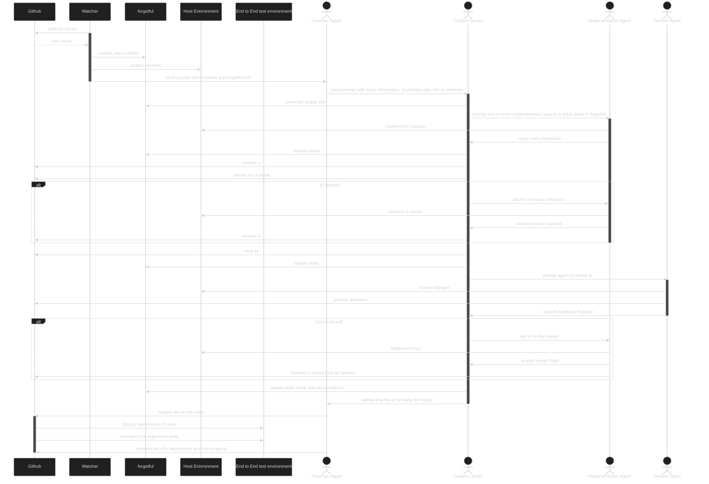

# Factory 
This repo documents the inner workings of a software factory.

## Inspiration

Inspired by [jovaneyck/software-factory-demo](https://github.com/jovaneyck/software-factory-demo/tree/main/.agents)

## Components 

|Component|Role|
|---------|----|
|Github|Code repository and ci/cd layer|
|Watcher|Script that will be responsible for monitoring configured github repositories, creating plans and passing info to the foreman|
|forgetful|Agentic Memory system that includes planning and tasks|
|Host Environment|This is where the agent will be operating inside, this could be a dev machine, vps or docker container - for mvp just host machine|
|End to End test environment|Isolated test environment that has changes deployed to and can be used to run end to end verification tests|
|Foreman Agent|Pi agent that is the primary interaction point for the user or the watcher script|
|Feature Owner|Sub agent that is used to own the particular feature or issue, can be any harness/model type supported by agent shell|
|Implementation Agent|Sub agent that is launched by the feature owner that is designated with implementing the changes|
|Review Agent|Sub agent that is launched by the feature owner that is designated with reviewing the changes|

## Configuration

The intention behind this repo is that it can be placed inside that of another repo and drive the
development of that repo using the software factory life-cylce.

You can configure a factory using the factory.toml file which allows the configuration of the following:

|Configuration|Type|Example|Description|
|-------------|-----|------|----------|
|repositories|list[string]|["git@github.com:ScottRBK/forgetful.gi", "git@github.com:ScottRBK/agentshell.gi"]|List of repositories that are monitored by the factory, can support multiple if required|
|watcher_label|list[string]|"factory"|list of strings indicating which labels the watcher should pick up, must be specified, accepts * as wild card for all|
|foreman_agent_model|string|"openai-codex/gpt-6.1-sol"|set the provider and model information for the foreman agent|
|foreman_agent_effort|string|"max"|thinking effort level of the foreman agent|
|feature_owner_agent_model|string|"openai-codex/gpt-6.1-sol"|set the provider and model information for the foreman agent|
|feature_owner_agent_harness|string|"codex"|agentic harness for the feature owner agent|
|feature_owner_agent_effort|string|"max"|thinking effort level of the foreman agent|
|implementation_agent_model|string|"openai-codex/gpt-6-luna"|set the provider and model information for the foreman agent|
|implementation_agent_harness|string|"codex"|agentic harness for the feature owner agent|
|implementation_agent_effort|string|"xhigh"|thinking effort level of the foreman agent|
|review_agent_model|string|"opus"|set the provider and model information for the review agent|
|review_agent_harness|string|"claude_code"|agentic harness for the review agent|
|review_agent_effort|string|"high"|thinking effort level of the review agent|

