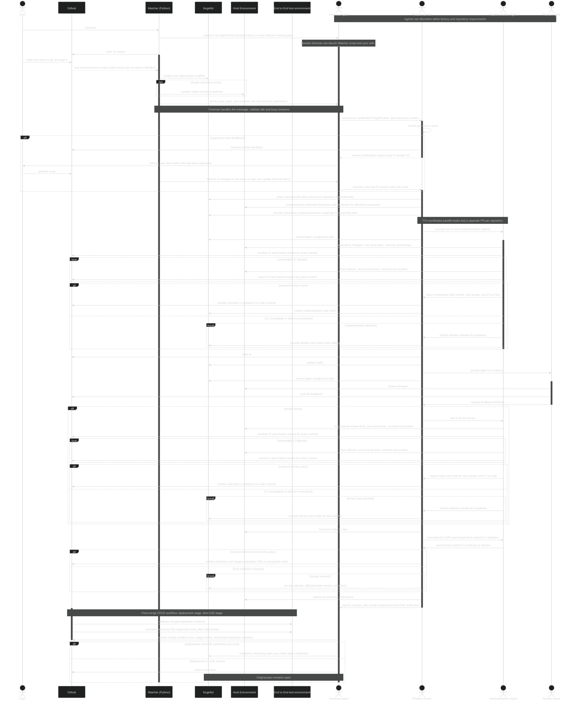

# Factory 
This repo documents the inner workings of a software factory.

## Inspiration

Inspired by [jovaneyck/software-factory-demo](https://github.com/jovaneyck/software-factory-demo/tree/main/.agents)

## Components 

|Component|Role|
|---------|----|
|Github|Code repository and ci/cd layer|
|Watcher|Python script: polls configured GitHub repos, scaffolds plans, notifies Foreman via tmux|
|forgetful|Agentic Memory system that includes planning and tasks|
|Host Environment|This is where the agent will be operating inside, this could be a dev machine, vps or docker container - for mvp just host machine|
|End to End test environment|Isolated test environment that has changes deployed to and can be used to run end to end verification tests|
|Foreman Agent|Pi agent that is the primary interaction point for the user or the watcher script|
|Feature Owner|Pi sub-agent that owns a feature or multi-repository epic|
|Implementation Agent|Sub agent that is launched by the feature owner that is designated with implementing the changes|
|Review Agent|Sub agent that is launched by the feature owner that is designated with reviewing the changes|




## Agent Setup

Beyond the below configuration each agent will utilise a predefined list of agents that each have
their own system prompt, tools (inc mcp) and skills.

|Agent|Tools|Skills|Responsibilties|
|-----|-----|------|---------------|
|Foreman|`forgetful`,`agent-shell`, `github`|`foreman`|Notified on new issues -> launches feature owners -> monitors feature owners -> communicates with user|
|Feature Owner|`forgetful`,`agent-shell`, `github`|`feature-owner`|Launched by Foreman -> uses grill me skill -> updates issues and foreman if more info needed -> builds proper plan -> launches implementation_agent_effort -> launches reviewer -> updates forgetful -> speaks to foreman|
|Implementation Agent|`bash`, `browser-tools/computer-use`, `github`|`tdd`, `{application-specific-architecture-skills}`|Launched by the feature owner -> implements changes -> commits -> fixes issues|
|Reviewer Agent|`bash`, `browser-tools/computer-use`, `github`|`{application or organisation specific coding standards}`|Launched by the feature owner -> reviews pr -> reoports back to github|

### Foreman extensions

- [pi-hide-tools-extension](https://github.com/ScottRBK/pi-hide-tools-extension): use `/hide-tools`
  to hide built-in tool rows in the Foreman's terminal. Extension tool rows remain visible;
  tool execution, model results, and session logs are unchanged.

## Tools
|Tool|Description|
|----|-----------|
|`forgetful`|[forgetful](https://github.com/ScottRBK/forgetful) is an mcp agent memory layer, also supports cli|
|`agent-shell`|[pi extension](https://github.com/ScottRBK/pi-agentshell-extension) or [python libary](https://github.com/ScottRBK/agent-shell) that abstracts the invocation of cli agents|
|`browser-tools`|tools used to give an agent access to a web browse, needed for reviewing or building web based apps|
|`computer-use`|grants an agent access to use a machine, needed for reviewing or building rich clients|
|`github`|tool to access gh, can just be gh cli installed with appropriate permissions| 

## Skills
|Skill|Description|
|-----|-----------|
|`foreman`|describes the roles and responsiblities of the foreman, along with expected workflow|
|`feature-owner`|describes the roles and responsibilities of the feature owner, along with expected workflow|
|`tdd`|skill for describing test driven development approach|
|`{application-specific-architecture-skills}`|skills pertaining to how the application should be implemented, eg hexagonal architectture, rust error handling etc.|
|`{application or organisation specific coding standards}`|any skills or instrunctions relating to coding standards|

## Configuration

The intention behind this repo is that it can be placed inside that of another repo and drive the
development of that repo using the software factory life-cylce.

You can configure a factory using the factory.toml file which allows the configuration of the following:

|Configuration|Type|Example|Description|
|-------------|-----|------|----------|
|repositories|dict|See example below.|Repositories monitored by the factory; supports multiple.|
|watcher_label|list[string]|"factory"|list of strings indicating which labels the watcher should pick up, must be specified, accepts * as wild card for all|
|foreman_agent_model|string|"openai-codex/gpt-6.1-sol"|set the provider and model information for the foreman agent|
|foreman_agent_effort|string|"max"|thinking effort level of the foreman agent|
|feature_owner_agent_model|string|"openai-codex/gpt-6.1-sol"|set the provider and model information for the foreman agent|
|feature_owner_agent_harness|string|"pi"|Fixed to Pi for feature-owner session tracking|
|feature_owner_agent_effort|string|"max"|thinking effort level of the foreman agent|
|implementation_agent_model|string|"openai-codex/gpt-6-luna"|set the provider and model information for the foreman agent|
|implementation_agent_harness|string|"codex"|agentic harness for the feature owner agent|
|implementation_agent_effort|string|"xhigh"|thinking effort level of the foreman agent|
|review_agent_model|string|"opus"|set the provider and model information for the review agent|
|review_agent_harness|string|"claude_code"|agentic harness for the review agent|
|review_agent_effort|string|"high"|thinking effort level of the review agent|

Repositories example:

```text
[
  { remote: "git@github.com:ScottRBK/forgetful.gi", local_dir: "~/gh/forgetful" },
  { remote: "git@github.com:ScottRBK/agentshell.gi", local_dir: "~/ai/agentshell" }
]
```


