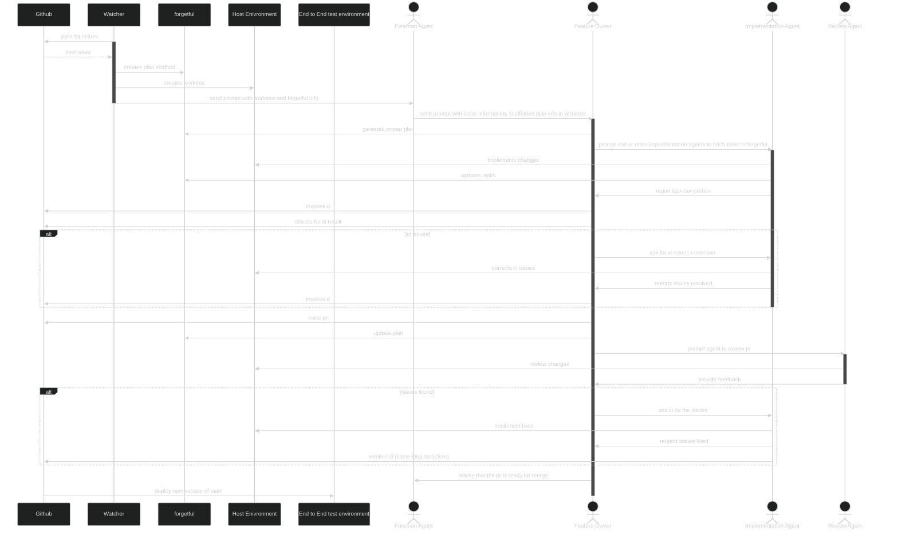

# Factory 
This repo documents the inner workings of a software factory.

## Inspiration

Inspired by [jovaneyck/software-factory-demo](https://github.com/jovaneyck/software-factory-demo/tree/main/.agents)

## Components 

|Component|Role|
|---------|----|
|Factory.sh|Script that will be responsible for monitoring configured github repositories, creating plans and passing info to the foreman|

## Configuration

The intention behind this repo is that it can be placed inside that of another repo and drive the
development of that repo using the software factory life-cylce.

You can configure a factory using the factory.toml file which allows the configuration of the following:

|Configuration|Type|Example|Description|
|-------------|-----|------|----------|
|repositories|list|["git@github.com:ScottRBK/forgetful.gi", "git@github.com:ScottRBK/agentshell.gi"]|List of repositories that are monitored by the factory, can support multiple if required|
|number_one|string|"openai-codex/gpt-6.1-sol"|set the provider and model information for the number one agent|

