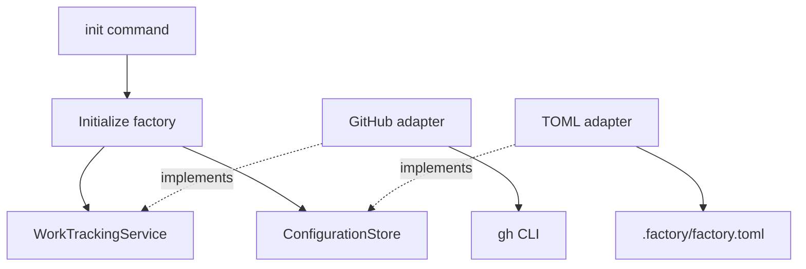

# Factory architecture

This document describes **how** the factory is structured. [FACTORY.md](../FACTORY.md) defines
**what** it does; [plan.md](plan.md) records **when** the work happens and agreed decisions.

Agents must keep this document up to date when changes affect the architecture. Distinguish
proposed behaviour from implemented behaviour; do not describe an agreed design as shipped code.

## Slice 1: factory initialization

Status: implemented, independently reviewed, and locally validated. Review findings were fixed
and regression-checked. Live GitHub validation and package publication have not been performed.

Ship a Python package exposing the `forgetful-factory` command. Once published, users can run:

```bash
uvx forgetful-factory init
```

Run initialization inside a repository or a directory containing a group of repositories. One
initialization creates one factory managing the selected repositories. Slice 1 builds and validates
locally only: use `uvx --from /absolute/path/to/the-built-wheel forgetful-factory init` until the
package is published. PyPI publication and package-name availability are not part of this slice.

Initialization configures repositories, watched labels, and the Foreman's model and effort. It
checks GitHub access and creates missing configured labels without changing existing labels.
Foreman settings are stored only: this slice does not launch agents, poll issues, use Forgetful,
create worktrees, or clone repositories.

## Architectural boundaries

Use hexagonal architecture with explicit service contracts and provider-independent models.
GitHub is the first provider, not the factory's domain model.

- **CLI:** parses commands, gathers user input, and displays results.
- **Application:** coordinates initialization using domain services and storage ports.
- **Domain:** defines shared concepts and provider-independent service contracts.
- **Adapters:** implement contracts using external tools and file formats.
- **Composition:** the CLI bootstrap constructs adapters and supplies them to the application.

The domain must not depend on GitHub, TOML, subprocesses, terminal input, or adapters.
Application workflows depend on contracts rather than concrete adapters. Use ordinary Python
composition; no dependency-injection framework is required.

### First-slice layout

```text
src/forgetful_factory/
├── cli/
│   ├── main.py                    # Arguments, prompts, and output
│   └── bootstrap.py               # Constructs and connects adapters
├── application/
│   ├── initialise_factory.py      # Initialization workflow
│   ├── configuration.py           # Configuration structure and validation
│   └── ports/
│       ├── configuration_store.py # Configuration read/write contract
│       ├── local_repositories.py  # Discover repositories and inspect origins
│       └── work_source_resolver.py # Map an origin to this integration's work source
├── domain/
│   ├── models.py                  # WorkSource, RepositoryReference, Label
│   └── services/
│       └── work_tracking.py       # WorkTrackingService contract
├── adapters/
│   ├── command.py                 # External command execution and error translation
│   ├── github/
│   │   └── work_tracking.py        # GitHub tracking and origin-to-source resolution
│   └── filesystem/
│       ├── git_repositories.py    # Local discovery and Git origin checks
│       └── toml_configuration.py  # TOML configuration storage
└── configuration.py               # Public configuration-loading API
```

`pyproject.toml` defines the package and console entry point. Configuration lives in the chosen
workspace at `.factory/factory.toml`, not inside uvx's package environment. Existing configuration
must not be silently overwritten. Use Python's built-in argument parsing and TOML reading;
GitHub authentication is supplied by the existing `gh` CLI. The build backend is pinned separately;
its pre-install checks are recorded in [dependency audit](dependency-audit.md).



Solid arrows show calls or dependencies; dotted arrows show contract implementations.

### Contracts and provider separation

For this slice, `WorkTrackingService` exposes access checks and label operations for a work source.
The GitHub adapter translates those operations into `gh` commands and maps failures into clear,
provider-independent errors. `ConfigurationStore` loads and saves factory configuration.
`LocalRepositories` provides bounded local discovery and origin inspection. `WorkSourceResolver`
is a separate application port: this integration maps a GitHub origin to a GitHub work source,
without making Git remotes part of the domain's work-tracking service contract. The GitHub adapter
implements both tracking and resolution; bootstrap supplies it through the separate contracts.

Work tracking and code hosting are separate responsibilities. A future Linear work item may refer
to GitHub repositories; an Azure DevOps work item need not imply Azure-hosted code. Add a separate
`CodeRepositoryService` when repository operations are implemented, rather than folding branches
and pull requests into work tracking. Do not add unused future operations to first-slice contracts.

Provider differences must remain explicit. If an adapter cannot support an operation, report that
limitation rather than pretending every provider has GitHub's behaviour.

### Initialization and failure behaviour

1. Load existing configuration, or gather repositories, labels, Foreman model, and effort.
2. Validate the complete configuration, workspace, and every local repository's current origin.
3. Check access and read every label page for all work sources before creating any labels.
4. Create missing configured labels; leave existing labels unchanged.
5. Atomically save new configuration without overwriting an existing file, and report the result.

The CLI separates argument parsing and new-configuration prompts from its error boundary.
The application separates complete preflight checks and individual label handling from the
initialization workflow; that workflow retains ordered progress reporting and failure handling.

Interactive discovery checks only the workspace and its direct children for their own `.git` marker,
including worktree files. The user selects repositories and confirms their displayed origins.
Explicit `--repo` arguments provide that confirmation for automation. Model and effort are nonblank
text settings, not validated against a live agent/model provider. Settings must be valid Unicode
without NUL characters, which filesystem and subprocess APIs cannot accept.

On a rerun, load and revalidate existing settings without prompting or rewriting their bytes.
Conflicting arguments, changed origins, mismatched work sources, and unsupported tracking providers
fail before GitHub calls.
Configuration changes require explicit edits to the TOML file. Multiple local copies of one remote
retain distinct configuration entries; label setup runs once per distinct work source.

A configured `*` means watch all labels in a later slice, not create a label named `*`. If mixed
with concrete label names, those concrete labels are still ensured. Label names match
case-insensitively, and duplicate CLI names retain their first spelling. GitHub calls explicitly
target `github.com`, regardless of `GH_HOST`. Missing labels use color `ededed` and description
`Factory work`; existing spelling, color, and description remain untouched.
Initialization is safe to repeat. If an operation fails after some labels were created, report
partial progress; do not delete labels as an automatic rollback. A rerun reuses existing labels.
Do not report success when required access, label setup, or configuration storage failed.
A timeout, interruption, or malformed response can leave the last remote operation uncertain;
report that uncertainty and advise checking GitHub and configuration before retrying. External
commands time out after 30 seconds.

### Configuration and platform scope

The repositories setting is a TOML dictionary keyed by absolute local repository paths. Each entry
contains `local_dir`, `remote`, `provider`, and `source`.
Code location and work tracking are separate. Top-level settings retain the names in `FACTORY.md`:
`watcher_label`, `foreman_agent_model`, and `foreman_agent_effort`.
`forgetful_factory.configuration.load_configuration` is the public validated loader.
Use `forgetful-factory init --help` for CLI flags. Example saved configuration:

```toml
watcher_label = ["factory"]
foreman_agent_model = "openai-codex/gpt-6.1-sol"
foreman_agent_effort = "max"

[repositories."/home/scott/projects/api"]
local_dir = "/home/scott/projects/api"
remote = "git@github.com:team/api.git"
provider = "github"
source = "team/api"
```

The first implementation targets POSIX hosts, including WSL, not native Windows. Storage uses
no-follow file opens and directory file descriptors to reject symlinked `.factory` directories and
configuration files. New configuration is written to a temporary file and exposed through an
atomic, non-overwriting hard link. Explicit repository paths must not contain symlink components.
No global configuration, credentials, runtime agent state, or service registration is installed.

### Validation

Use TDD at the two public boundaries approved by Scott:

- **Initialization CLI:** exercise the real command with temporary Git repositories and files.
  Substitute only the external `gh` executable, covering configuration, label setup, safe reruns,
  and failures without touching live GitHub repositories.
- **Configuration loading:** read saved TOML through the public loading API, checking round-trips
  and rejection of invalid settings.

Do not add tests coupled to private helpers or internal mock calls. Use Python's `unittest` without
additional test dependencies. Independently validate the installed package through local `uvx`.
Live GitHub label validation in Dark Business requires separate confirmation of target repositories.

Local validation passed 28 tests, the offline wheel/source-distribution build, and independent
wheel-installed CLI checks for multiple repositories, label preservation, reruns, conflicts, denied
access, and invalid settings. The package has no runtime Python dependencies. See the
[plan](plan.md) for remaining live validation and recorded SonarQube findings.

The GitHub Actions workflow `.github/workflows/ci.yml` runs the same test suite on every push,
without branch, tag, or path filters, and on pull-request opening, reopening, and updates.
New runs cancel older runs for the same workflow and ref. Push and PR refs remain separate, so
an open PR's branch push also produces a PR run. Separate `ubuntu-latest` jobs use Python 3.11
and 3.12. No Python packages or project secrets are required; tests substitute the external `gh`.
At Scott's request, official checkout and Python setup actions use movable `v7` tags to receive
compatible updates. Permissions remain read-only and checkout credentials are not persisted.
See [dependency audit](dependency-audit.md) for the checked releases, inherited advisories, and
limits: subsequent tag moves are not covered by that audit. Hosted push CI passed all 28 tests
on both Python versions for implementation commit `2ee6e6b`; the [plan](plan.md) links the run.
PR-event execution and cancellation have not yet been exercised on GitHub.

Local static analysis uses the existing SonarScanner CLI against `http://localhost:9001`, project
`forgetful-factory`. Ignored `.sonarqube/` metadata and a scan script identify this project and scan
`src/` plus `tests/`; the root ignored `.env` supplies the analysis token through environment
variables. This is a development check, not a factory runtime dependency. The selected server gate
is `Sonar way sans code coverage`; complexity rules come from the Python quality profile. Local
scanner setup does not follow Git worktrees and must be repeated where needed.
