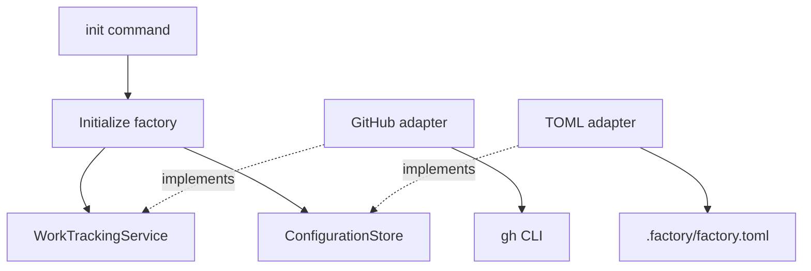

# Factory architecture

This document describes **how** the factory is structured. [FACTORY.md](../FACTORY.md) defines
**what** it does; [plan.md](plan.md) records **when** the work happens and agreed decisions.

Agents must keep this document up to date when changes affect the architecture. Distinguish
proposed behaviour from implemented behaviour; do not describe an agreed design as shipped code.

## Slice 1: factory initialization

Status: proposed; not yet implemented.

Ship a Python package exposing the `forgetful-factory` command. Once published, users can run:

```bash
uvx forgetful-factory init
```

Run initialization inside a repository or a directory containing a group of repositories. One
initialization creates one factory managing the selected repositories. Package-name availability
and publication remain to be verified; the command above describes the intended distribution.

Initialization configures repositories, watched labels, and the Foreman's model and effort. It
checks GitHub access and creates missing configured labels without changing existing labels.
Foreman settings are stored only: this slice does not launch agents, poll issues, use Forgetful,
create worktrees, or clone repositories.

## Architectural boundaries

Use hexagonal architecture with explicit service contracts and provider-independent models.
GitHub is the first provider, not the factory's domain model.

- **CLI:** parses commands, gathers user input, and displays results.
- **Application:** coordinates initialization using domain services and storage ports.
- **Domain:** defines shared concepts and provider-independent service contracts.
- **Adapters:** implement contracts using external tools and file formats.
- **Composition:** the CLI bootstrap constructs adapters and supplies them to the application.

The domain must not depend on GitHub, TOML, subprocesses, terminal input, or adapters.
Application workflows depend on contracts rather than concrete adapters. Use ordinary Python
composition; no dependency-injection framework is required.

### First-slice layout

```text
src/forgetful_factory/
├── cli/
│   ├── main.py                    # Arguments, prompts, and output
│   └── bootstrap.py               # Constructs and connects adapters
├── application/
│   ├── initialise_factory.py      # Initialization workflow
│   ├── configuration.py           # Configuration structure and validation
│   └── ports/
│       └── configuration_store.py # Configuration read/write contract
├── domain/
│   ├── models.py                  # WorkSource, RepositoryReference, Label
│   └── services/
│       └── work_tracking.py       # WorkTrackingService contract
└── adapters/
    ├── github/
    │   └── work_tracking.py        # GitHub implementation using the gh CLI
    └── filesystem/
        └── toml_configuration.py  # TOML configuration storage
```

`pyproject.toml` defines the package and console entry point. Configuration lives in the chosen
workspace at `.factory/factory.toml`, not inside uvx's package environment. Existing configuration
must not be silently overwritten. Use Python's built-in argument parsing and TOML reading;
GitHub authentication is supplied by the existing `gh` CLI.



Solid arrows show calls or dependencies; dotted arrows show contract implementations.

### Contracts and provider separation

For this slice, `WorkTrackingService` exposes access checks and label operations for a work source.
The GitHub adapter translates those operations into `gh` commands and maps failures into clear,
provider-independent errors. `ConfigurationStore` loads and saves factory configuration.

Work tracking and code hosting are separate responsibilities. A future Linear work item may refer
to GitHub repositories; an Azure DevOps work item need not imply Azure-hosted code. Add a separate
`CodeRepositoryService` when repository operations are implemented, rather than folding branches
and pull requests into work tracking. Do not add unused future operations to first-slice contracts.

Provider differences must remain explicit. If an adapter cannot support an operation, report that
limitation rather than pretending every provider has GitHub's behaviour.

### Initialization and failure behaviour

1. Gather repository, label, Foreman model, and effort settings.
2. Validate the complete configuration before changing GitHub.
3. Check access to all configured work sources before creating labels.
4. Create missing configured labels; leave existing labels unchanged.
5. Save configuration and report the result.

A configured `*` means watch all labels in a later slice, not create a label named `*`.
Initialization must be safe to repeat. If an operation fails after some labels were created, report
partial progress; do not delete labels as an automatic rollback. A rerun reuses existing labels.
Do not report success when required access, label setup, or configuration storage failed.

### Validation

Use TDD for implementation. Configuration tests cover valid and invalid settings. Workflow tests
use substitute services and storage to check ordering, repeat initialization, and failure handling.
Adapter tests verify GitHub command/result translation and TOML persistence. CLI tests exercise the
initialization command and its messages. Ordinary automated tests must not mutate real GitHub
repositories. Independently validate the initialization journey against an approved test repository.
